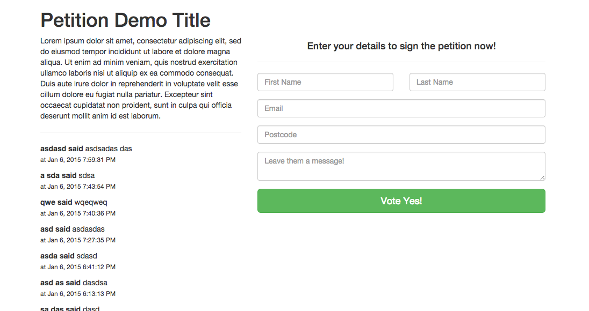

<h1>Momentum.build Petition module for Angular</h1>



<h3>Use (Simple):</h3>

<p>1. bower install momentum-petition --save</p>
<p>2. Add angular, ngLodash and petition.js as scripts in your html</p>
```
<script src="bower_components/angular/angular.min.js"></script>
<script src="bower_components/ng-lodash/build/ng-lodash.min.js"></script>
<script src="bower_components/dist/petition.js"></script>
```

<p>3. Add 'momentum.petition' as dependancy to app module.</p>
```
angular.module('actionExample', ['ngAnimate', 'momentum.petition', 'mgcrea.ngStrap', 'ngLodash'])
```

<p>4. call directive with campaign and action id's.</p>
```
<petition-feed campaign-id="49" action-id="41" />
<petition-form campaign-id="49" action-id="41" />
```

<h3>Use (Custom):</h3>
<p>Custom uncompiled example located in 'app/uncompiled-example/'. Uses gulp and jade and compiles to 'example/' folder.</p>


